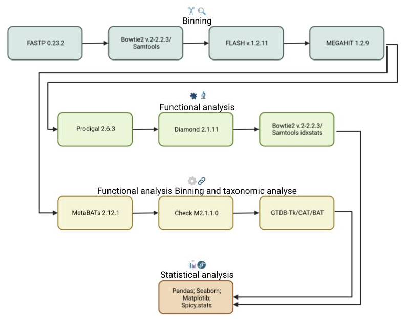
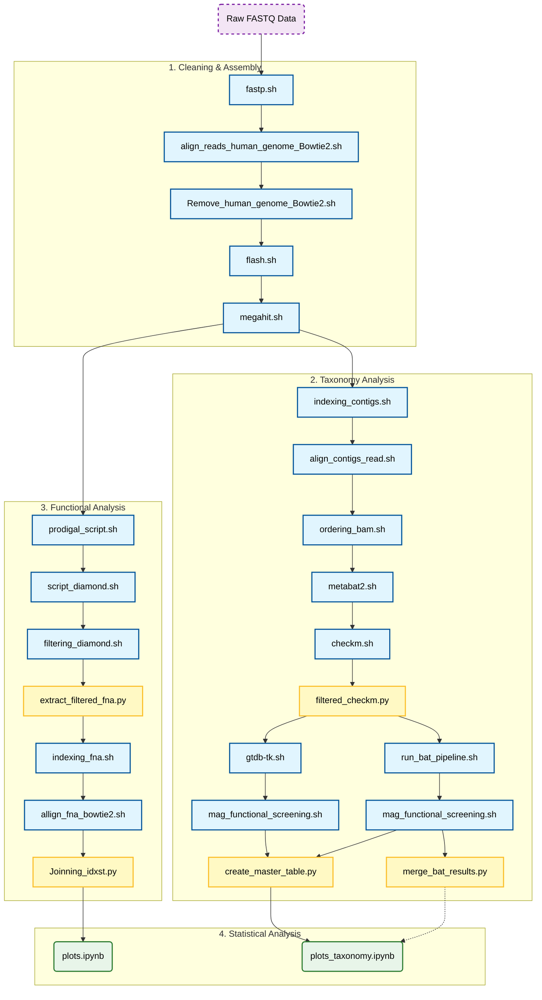

# Investigation of the cross-feeding mechanism of sialic acids between *Staphylococcus aureus* and commensal bacteria in the context of atopic dermatitis.



*(Figure: Workflow of the bioinformatic analysis)*

---

## FLASH Tools Configuration

To calculate the parameters `-m` (minimum) and `-M` (maximum), use the following formula:

> **Overlap = (2 × Reads) - Fragment**

### How to obtain the values:

1.  **Read Length:** Use the `zcat` command to inspect the raw file:
    ```bash
    zcat /home/marcos/PRJEB59406/fastq_files/ERR10856949_1.fastq.gz | head -n 2 | tail -n 1 | wc -c
    ```

2.  **Fragment Size:** * Open the **HTML report** generated by `fastp`.
    * Look for the **Insert Size Estimation** graph.
    * Use the value indicated at the **Peak**.


## Execution Order



### 1. Preparation

*(Initial data setup and database downloads)*

### 2. Cleaning and Assembly

The pipeline follows this specific sequence:

1. `fastp.sh` (Quality Control)
2. `align_reads_human_genome_Bowtie2.sh` (Host Alignment)
3. `Remove_human_genome_Bowtie2.sh` (Decontamination)
4. `flash.sh` (Merge Paired-end Reads)
5. `megahit.sh` (Assembly)

### 3. Taxonomy Analysis

1. `indexing_contigs.sh` (Contig Indexing)
2. `align_contigs_read.sh` (Map Reads for Coverage)
3. `ordering_bam.sh` (BAM Sorting)
4. `metabat2.sh` (Binning)
5. **Quality & Standard Classification:**
* `checkm.sh` (Quality Assessment)
* `filtered_checkm.py` (Quality Filtering)
* `gtdb-tk.sh` (Taxonomic Classification)


6. **Validation & Contamination Check (CAT/BAT):**
* `run_bat_pipeline.sh` (Taxonomic Classification via Homology)
* `merge_bat_results.py` (Aggregate BAT Reports)


7. `mag_functional_screening.sh` (Targeted Functional Search)
8. `create_master_table.py` (Data Aggregation)

### 4. Functional Analysis

1. `prodigal_script.sh` (Gene Prediction)
2. `script_diamond.sh` (Protein Alignment)
3. `filtering_diamond.sh` (Quality Filtering)
4. `extract_filtered_fna.py` (Sequence Extraction)
5. `indexing_fna.sh` (Index Building)
6. `allign_fna_bowtie2.sh` (Alignment)
7. `indexing_idxstats.py`
8. `Joinning_idxst.py` (Statistical Merging)

### 5. Statistical Analysis: 
- `plots_doc_simple`


## Reference

BUCHFINK, B.; XIE, C.; HUSON, D. H. Fast and sensitive protein alignment using DIAMOND. Nature Methods, v. 12, n. 1, p. 59–60, 17 nov. 2014.

CHAUMEIL, P.-A.; MUSSIG, A. J.; HUGENHOLTZ, P.; PARKS, D. H. GTDB-Tk v2: memory friendly classification with the genome taxonomy database. Bioinformatics, v. 38, n. 23, p. 5315–5316, 11 out. 2022.

CHEN, S. Ultrafast one‐pass FASTQ data preprocessing, quality control, and deduplication using fastp. iMeta, v. 2, n. 2, 8 maio 2023.

DANECEK, P.; BONFIELD, J. K.; LIDDLE, J.; MARSHALL, J.; OHAN, V.; POLLARD, M. O.; WHITWHAM, A.; KEANE, T.; MCCARTHY, S. A.; DAVIES, R. M.; LI, H. Twelve years of SAMtools and BCFtools. GigaScience, v. 10, n. 2, 29 jan. 2021.

HARRIS, C. R.; MILLMAN, K. J.; VAN DER WALT, S. J.; GOMMERS, R.; VIRTANEN, P.; COURNAPEAU, D.; WIESER, E.; TAYLOR, J.; BERG, S.; SMITH, N. J.; KERN, R.; PICUS, M.; HOYER, S.; VAN KERKWIJK, M. H.; BRETT, M.; HALDANE, A.; DEL RÍO, J. F.; WIEBE, M.; PETERSON, P.; GÉRARD-MARCHANT, P. Array Programming with NumPy. Nature, v. 585, n. 7825, p. 357–362, 16 set. 2020. Disponível em: <https://www.nature.com/articles/s41586-020-2649-2>.

HYATT, D.; CHEN, G.-L.; LOCASCIO, P. F.; LAND, M. L.; LARIMER, F. W.; HAUSER, L. J. Prodigal: prokaryotic gene recognition and translation initiation site identification. BMC Bioinformatics, v. 11, n. 1, 8 mar. 2010.

LANGMEAD, B.; WILKS, C.; ANTONESCU, V.; CHARLES, R. Scaling read aligners to hundreds of threads on general-purpose processors. Bioinformatics, v. 35, n. 3, p. 421–432, 18 jul. 2018.

LI, D.; LIU, C.-M.; LUO, R.; SADAKANE, K.; LAM, T.-W. MEGAHIT: an ultra-fast single-node solution for large and complex metagenomics assembly via succinct de Bruijn graph. Bioinformatics, v. 31, n. 10, p. 1674–1676, 20 jan. 2015. Disponível em: <https://arxiv.org/pdf/1409.7208.pdf>.

MAGOC, T.; SALZBERG, S. L. FLASH: fast length adjustment of short reads to improve genome assemblies. Bioinformatics, v. 27, n. 21, p. 2957–2963, 7 set. 2011.

PARKS, D. H.; IMELFORT, M.; SKENNERTON, C. T.; HUGENHOLTZ, P.; TYSON, G. W. CheckM: assessing the quality of microbial genomes recovered from isolates, single cells, and metagenomes. Genome Research, v. 25, n. 7, p. 1043–1055, 14 maio 2015. Disponível em: <https://www.ncbi.nlm.nih.gov/pmc/articles/PMC4484387/>.

VIRTANEN, P.; GOMMERS, R.; OLIPHANT, T. E.; HABERLAND, M.; REDDY, T.; COURNAPEAU, D.; BUROVSKI, E.; PETERSON, P.; WECKESSER, W.; BRIGHT, J.; VAN DER WALT, S. J.; BRETT, M.; WILSON, J.; MILLMAN, K. J.; MAYOROV, N.; NELSON, A. R. J.; JONES, E.; KERN, R.; LARSON, E.; CAREY, C. J. SciPy 1.0: fundamental algorithms for scientific computing in Python. Nature Methods, v. 17, n. 3, p. 261–272, 3 fev. 2020. Disponível em: <https://www.nature.com/articles/s41592-019-0686-2>.

VON MEIJENFELDT, F. A. B.; ARKHIPOVA, K.; CAMBUY, D. D.; COUTINHO, F. H.; DUTILH, B. E. Robust taxonomic classification of uncharted microbial sequences and bins with CAT and BAT. Genome Biology, v. 20, n. 1, 22 out. 2019. Acesso em: 14 fev. 2022.


```