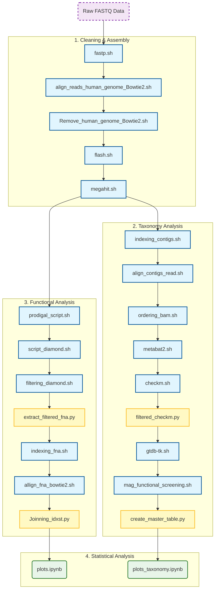

# Ph.D. Project

**Title:** Investigation of the cross-feeding mechanism of sialic acids between *Staphylococcus aureus* and commensal bacteria in the context of atopic dermatitis.


*(Figure: Workflow of the bioinformatic analysis)*

---

## FLASH Tools Configuration

To calculate the parameters `-m` (minimum) and `-M` (maximum), use the following formula:

> **Overlap = (2 × Reads) - Fragment**

### How to obtain the values:

1.  **Read Length:** Use the `zcat` command to inspect the raw file:
    ```bash
    zcat /home/marcos/PRJEB59406/fastq_files/ERR10856949_1.fastq.gz | head -n 2 | tail -n 1 | wc -c
    ```

2.  **Fragment Size:** * Open the **HTML report** generated by `fastp`.
    * Look for the **Insert Size Estimation** graph.
    * Use the value indicated at the **Peak**.

## Execution Order



### 1. Preparation

*(Initial data setup)*

### 2. Cleaning and Assembly

The pipeline follows this specific sequence:

1. `fastp.sh` (Quality Control)
2. `align_reads_human_genome_Bowtie2.sh` (Host Alignment)
3. `Remove_human_genome_Bowtie2.sh` (Decontamination)
4. `flash.sh` (Merge Paired-end Reads)
5. `megahit.sh` (Assembly)

### 3. Taxonomy Analysis

1. `indexing_contigs.sh` (Contig Indexing)
2. `align_contigs_read.sh` (Map Reads for Coverage)
3. `ordering_bam.sh` (BAM Sorting)
4. `metabat2.sh` (Binning)
5. `checkm.sh` (Quality Assessment)
6. `filtered_checkm.py`(Quality Filtering)
7. `gtdb-tk.sh` (Taxonomic Classification)
8. `mag_functional_screening.sh` (Targeted Functional Search)
9. `create_master_table.py` (Data Aggregation)

### 4. Functional Analysis

1. `prodigal_script.sh` (Gene Prediction)
2. `script_diamond.sh` (Protein Alignment)
3. `filtering_diamond.sh` (Quality Filtering)
4. `extract_filtered_fna.py` (Sequence Extraction)
5. `indexing_fna.sh` (Index Building)
6. `allign_fna_bowtie2.sh` (Alignment)
7. `Joinning_idxst.py` (Statistical Merging)

### 5. Statistical Analysis

* **Functional Data:** `plots.ipynb`
* **Taxonomic Data:** `plots_taxonomy.ipynb`

```

```